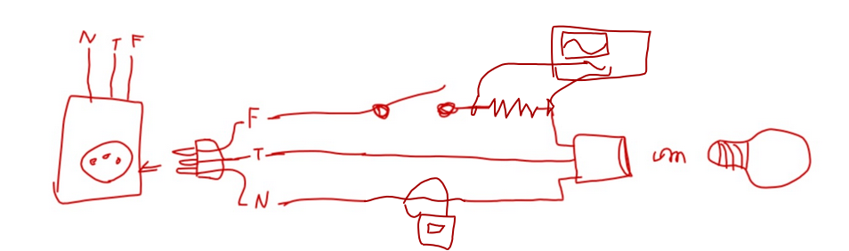

# Circuito_Lâmpada
## Sumário

* [Sumário](#sumário)
* [Objetivo](#objetivo)
* [Componentes](#componentes)
  * [Parâmetros](#parâmetros)
  * [Lista de materiais](#lista-de-materiais)
  * [Links de Lojas](#links-de-lojas)
* [Teste](#teste)
  * [Diagrama de conexões](#diagrama-de-conexões)
  * [Roteiro](#roteiro)
* [Notas](#notas)

## Objetivo
O esquemático do circuito da lâmpada tem como objetivo:

- Modelar a lâmpada para 127 V
- Modelar a fonte de alimentação para a lâmpada (rede elétrica residencial monofásica)
- Acoplar ao circuito lógico para que este tenha a capacidade de controlar o acionamento da lâmpada
- Simular o circuito no tempo

## Componentes
### Parâmetros

|    Parâmetro    |         Valor         |  Unidade  |
|:---------------:|:---------------------:|:---------:|
| Rede_Eletrica.U |      179,6051224      |     V     |
| Rede_Eletrica.f |           60          |     Hz    |
|     S1.init     |           on          | [on, off] |
|     S1.time     | 20,833334 ; 16,666667 |     ms    |
|   R_Lampada.R   |         2.670         |     Ω     |
|      L1.Vj      |          0,7          |     V     |
|      L2.Vj      |          0,7          |     V     |

### Lista de materiais

|             Componente            | Quantidade | Valor Unitário |  Total  |
|:---------------------------------:|:----------:|:--------------:|:-------:|
| Lâmpada LED Kian                  |      1     |     R$ 5,90    | R$ 5,90 |
| Interruptor Simples Steck         |      1     |     R$ 4,99    | R$ 4,99 |
| Soquete p/ Lâmpada Cinza Kit-Flex |      1     |     R$ 7,50    | R$ 7,50 |
| Plug 10A Macho Branco 3P          |      1     |     R$ 3,83    | R$ 3,83 |

### Links de Lojas
[Lâmpada LED Kian](https://produto.mercadolivre.com.br/MLB-1923315495-lmpada-de-led-6w-branco-frio-6500k-kian-3un-casa-banheiro-_JM?matt_tool=18956390&utm_source=google_shopping&utm_medium=organic)

[Soquete p/ Lâmpada Cinza Kit-Flex](https://www.telhanorte.com.br/soquete-de-porcelana-para-lampada-e27-250v-cinza-kitflex-1062166/p)

[Interruptor Simples Steck](https://www.leroymerlin.com.br/conjunto-de-interruptor-simples-10a-branco-stella-steck_89281185?store_code=57&gclid=CjwKCAjwgISIBhBfEiwALE19Sf0D80_Ig8xVc_FWCSRey2Ol4-RC1_ciWqhil_se6mTfV6H4XQu7gxoCXjgQAvD_BwE)

[Plug 10A Macho Branco 3P](https://www.eletroluz.net/76215/pino-alumbra-10a-macho-branco-3p-reto--2731/)

## Teste

O teste do circuito tem o objetivo de verificar se:

- O circuito cumpre o seu objetivo
- Realizar medições no circuito
- Verificar se os parâmetros calculados e/ou simulados estão corretos
- Gerar feedback sobre a qualidade do circuito

### Diagrama de conexões

### Roteiro

** Em progresso **

## Notas
